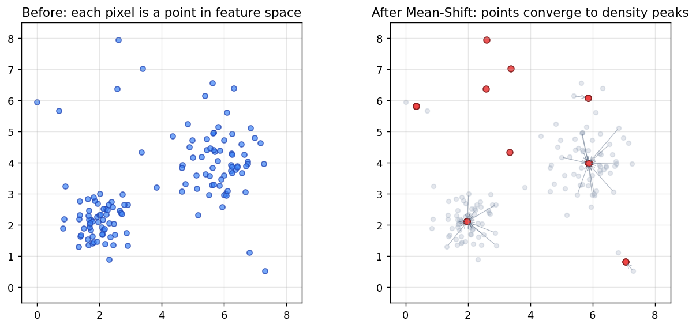
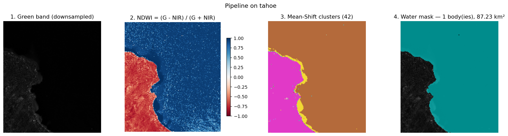
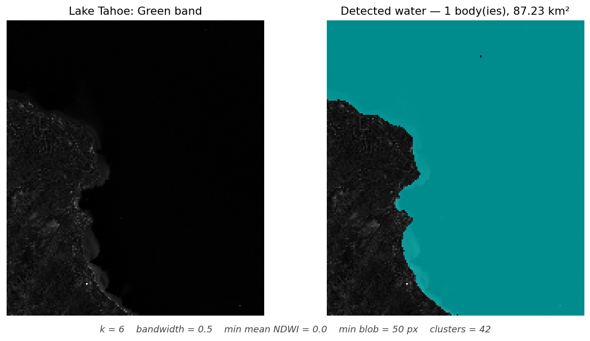
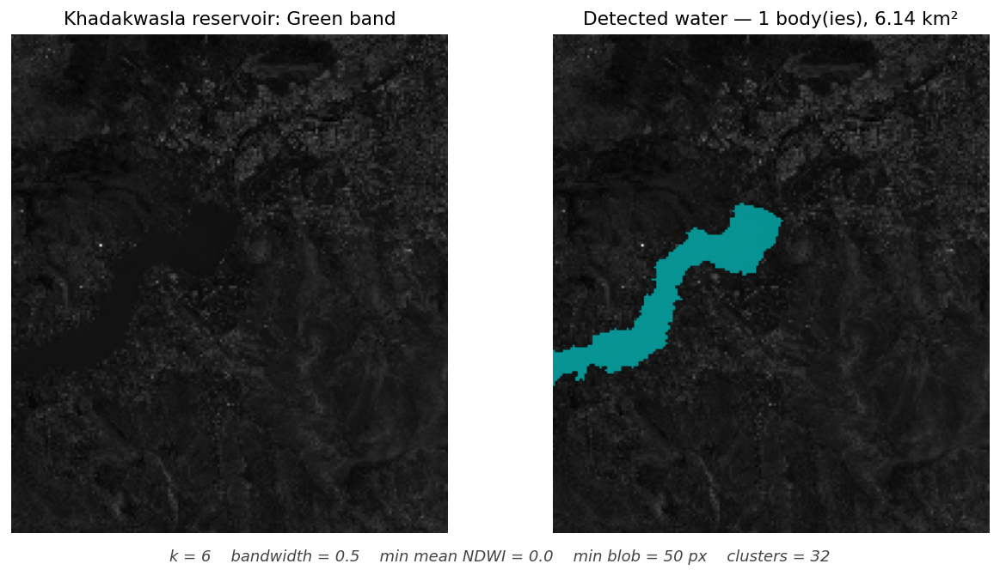
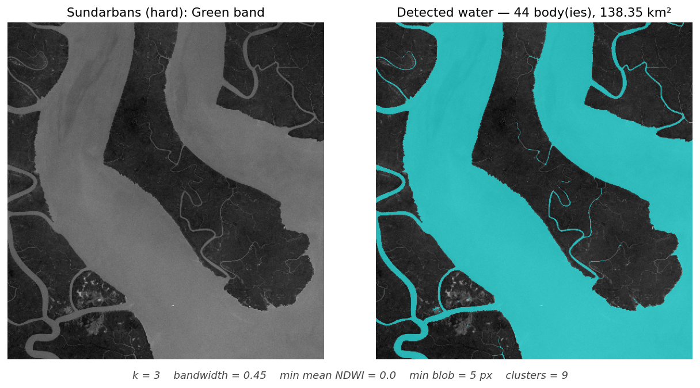

# NDWI Water-Body Segmentation

Our group's GNR 602 project (Problem Statement #6). The goal: take the
Green and Near-Infrared bands of a satellite image, compute NDWI from
them, stack the three bands (Green, NIR, NDWI) into one image, and run
Mean-Shift segmentation on it to pull out the water bodies. We wrote
the Mean-Shift part from scratch.

### Team
- Tanmay Mandaliya
- Rohan Kunchala
- Pravesh Khaparde


## How to run it

Double-click `run.bat`. The first time you do this it sets up a Python
venv and installs the packages from `requirements.txt` (a minute or so),
and then it launches Streamlit and pops the UI in your browser. Close
the console window to stop the server.

Python 3.10 or newer needs to be on PATH. We tried packaging the whole
thing into a single `.exe` with PyInstaller, but Windows Device Guard on
this machine blocks unsigned PyInstaller binaries, so we fell back to
the .bat launcher.

If you want to do it manually:

```
python -m venv venv
venv\Scripts\activate
pip install -r requirements.txt
streamlit run app.py
```


## What's in the project

Three Python files do all the work.

`waterbody.py` (about 120 lines) has all the algorithm code. The
function we actually defend in the viva is `segment()`, which is our
Mean-Shift implementation. The other functions in there (`load_bands`,
`compute_ndwi`, `stack_bands`, `pick_water`, `clean`) are short helpers.

`app.py` is the Streamlit UI. It just calls the functions in
`waterbody.py` and shows the results across five tabs.

`requirements.txt` pins the libraries we use.

There's also `data/samples/` with 10 Sentinel-2 scenes (Tahoe, Mumbai,
Sundarbans, Khadakwasla, etc.) that we pulled from AWS Open Data so the
demo works straight away with no data hunting. Each scene is a Green
band tif and an NIR band tif.


## How NDWI works

The basic idea is that water reflects green light but absorbs
near-infrared, while plants do the opposite. So if you compute

```
NDWI = (Green - NIR) / (Green + NIR)
```

for every pixel, you get a number between -1 and +1 that tells you how
water-like the pixel looks. Anything above zero is usually water.
Vegetation comes out negative, built-up land sits near zero.

That's the whole index. No model, no training data, just one formula
applied to every pixel.


## How Mean-Shift works (briefly)

Once we have NDWI, we stack Green, NIR and NDWI together so each pixel
becomes a 3D point in feature space. Mean-Shift groups these points by
density: it walks every point toward the average of its neighbours
within a radius (the bandwidth), repeats until they stop moving, and
clusters the points that ended up in the same place.

Water pixels all have similar (Green, NIR, NDWI) values so they form
one cluster. Vegetation forms another. Built-up forms another. Then we
just look at each cluster's average NDWI, and the ones above zero we
call water.

We use scipy's `cKDTree` to make the neighbour search fast, but the
shift loop, the Gaussian weights, the convergence check and the mode
merging are all hand-written in `segment()`.

The 2D toy figure below shows the idea (arrows are how each point
moves toward its local density peak):




## The full pipeline, in one figure

This is the whole pipeline run on Lake Tahoe with the default
parameters:



From left to right: the raw Green band, the NDWI map (blue is
water-like and red is land-like), the Mean-Shift cluster labels (each
colour is one cluster), and the final water mask drawn in cyan over the
input.


## The four parameters in the UI

`k` (downsample factor) - we keep every k-th pixel before running
Mean-Shift, otherwise it would take forever. k=6 turns a 1000x1000
image into about 167x167.

`bandwidth` - the search radius in feature space. Smaller means many
small clusters, larger means few big clusters. 0.5 worked well for us
across most scenes.

`min mean NDWI` - a cluster has to have an average NDWI above this for
us to count it as water. We default to 0.0, which is the classic
remote-sensing rule.

`min blob (px)` - after the water mask is built, drop any connected
blob smaller than this. Default is 50, which on a downsampled scene is
roughly 0.18 km^2. Small enough to keep real water bodies, big enough
to throw out sensor noise.


## A note on what `bandwidth` actually means

This is the one parameter that confused us when we were writing the
code, so it's worth being careful about it. Bandwidth is *not*
measured in image pixels. It's the radius of a Euclidean distance
search in the 3D feature space (Green, NIR, NDWI), after we z-score
normalise everything.

So when you set bandwidth = 0.5, you're saying "two pixels are
neighbours if their (Green, NIR, NDWI) feature vectors differ by less
than 0.5 standard deviations in 3D Euclidean distance." It's a
spectral-similarity radius, not a spatial one.

This is also why two pixels right next to each other on the image can
be far apart for Mean-Shift (a shoreline pixel: the water side and the
sand side touch on the image but look completely different
spectrally), and two pixels on opposite ends of the image can be
neighbours (two patches of the same lake).

The detail comes from `scipy.spatial.cKDTree.query_ball_point` which we
call as `tree.query_ball_point(x, r=bandwidth)`. Default `p=2` so the
norm is Euclidean.


## Results

### Default parameters: Lake Tahoe and Khadakwasla reservoir

Both of these are easy cases for the algorithm: clean shoreline, large
well-defined water bodies. Default parameters (k=6, bandwidth=0.5,
min_ndwi=0.0, min_blob=50) handle them in about a minute.





### Hard case: Sundarbans mangrove channels

The defaults work fine for big blobs of water but they miss thin
features because of the downsampling and the 50-pixel blob filter. So
for the Sundarbans we dropped k from 6 down to 3 (less downsampling)
and min_blob from 50 down to 5 (smaller blobs allowed). The same
algorithm now picks up the dense channel network that defaults
completely miss.

This run took roughly 21 hours on a normal laptop. The Sundarbans is
spectrally diverse - water at different turbidity, mangroves at
different growth stages - so Mean-Shift produces hundreds of modes,
which makes our pure-Python shift loop very slow. With more compute
or a vectorised implementation it would be much faster.



### Parameters used for each figure above

| Figure | k | bandwidth | min mean NDWI | min blob (px) |
|---|---|---|---|---|
| pipeline walkthrough (Tahoe) | 6 | 0.50 | 0.00 | 50 |
| Lake Tahoe | 6 | 0.50 | 0.00 | 50 |
| Khadakwasla | 6 | 0.50 | 0.00 | 50 |
| Sundarbans (hard) | 3 | 0.45 | 0.00 | 5 |


## What's ours and what's a library

The course rubric is strict about this, so here's a clean breakdown.

We wrote: the NDWI formula, the band stacking, the entire Mean-Shift
algorithm (the shift loop, the Gaussian kernel weights, the convergence
check, the mode merging), the water-cluster selection rule, and the
blob cleanup pass.

We use libraries for: rasterio (reads GeoTIFFs), numpy (array math),
scipy.spatial.cKDTree (fast neighbour lookup - this is *not* the
algorithm, just a data structure that lets us ask "give me all points
within radius r" quickly), scipy.ndimage.label (connected components),
streamlit (the UI), matplotlib (plotting).

We deliberately did not use `sklearn.cluster.MeanShift` or
`cv2.pyrMeanShiftFiltering`, because those would mean we never wrote
the algorithm in the first place.


## Project layout

```
.
├── app.py                       # Streamlit UI
├── waterbody.py                 # All the algorithm code
├── requirements.txt
├── run.bat                      # Double-click launcher (Windows)
├── README.md
├── project_presentation.pptx    # Slide deck for the class presentation
├── data/samples/                # 10 Sentinel-2 scenes (20 .tif files)
└── figures/                     # PNGs embedded in this README
```
