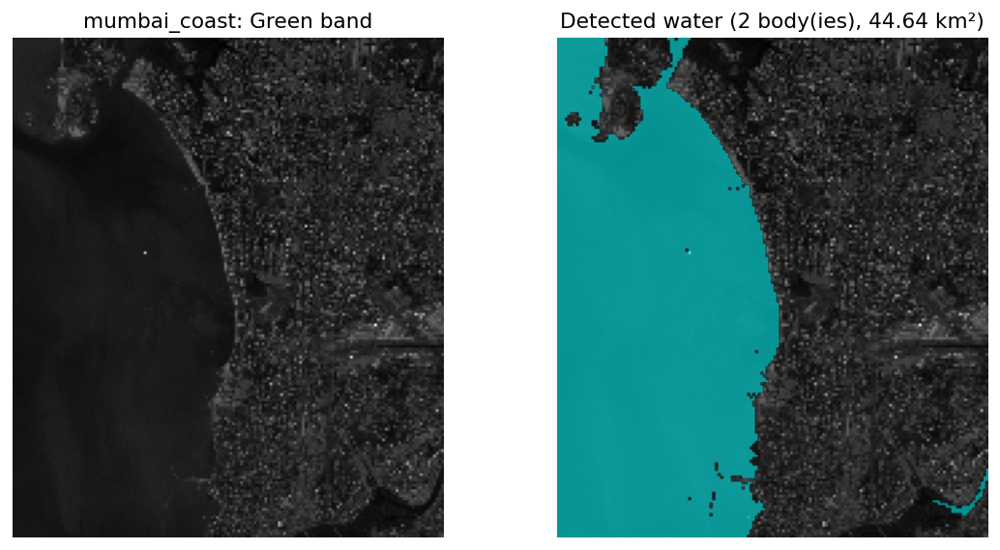
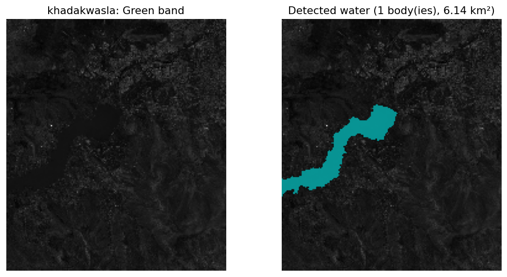

# NDWI Water-Body Segmentation

**GNR Semester 8 course project — Problem Statement #6**

*Tanmay Mandaliya · Rohan · Pravesh Khaparde*

---

## 1. What the project does

Given a **Green-band** and a **Near-Infrared-band** satellite image of the same
place (two GeoTIFF files), our tool finds all the water bodies in the scene and
returns a black-and-white **water mask** (white = water, black = everything else),
together with the area of each water body in km².

The assignment required two things:

1. Use **NDWI** — the Normalized Difference Water Index — and stack the Green,
   NIR, and NDWI bands into one 3-band image.
2. Extract water bodies by running **Mean-Shift segmentation** on that 3-band
   image.

We built:

- A small Python package (`waterbody.py`) with the algorithm and helpers.
- A **Streamlit UI** (`app.py`) where you pick a scene from a dropdown, tweak
  parameters with sliders, and see the result across five tabs.
- A set of 10 **Sentinel-2 sample scenes** covering different kinds of water
  bodies (mountain lakes, coastlines, reservoirs, rivers, etc.) so the demo
  works out of the box, no data hunting needed.

No training data, no labels, no GPU. Just pure math and an algorithm.

---

## 2. The NDWI index — why water pops out

Water and plants behave very differently in different parts of the light
spectrum:

- Water **reflects** visible Green light reasonably well, but **absorbs**
  Near-Infrared almost completely.
- Vegetation does the **opposite** — it absorbs Green (because chlorophyll uses
  it) and strongly reflects Near-Infrared.

NDWI exploits this gap with a single formula:

$$\text{NDWI} = \frac{\text{Green} - \text{NIR}}{\text{Green} + \text{NIR}}$$

Values sit in the range [−1, +1]:

- **NDWI > 0** → the pixel reflects more Green than NIR → likely **water**.
- **NDWI < 0** → the pixel reflects more NIR than Green → likely **land or vegetation**.

NDWI is a deterministic formula, not a machine-learning model. It doesn't need
training data. Every pixel is computed independently.

---

## 3. The 3-band feature space

The assignment asks us to stack **three** 2-D images — Green, NIR, and NDWI —
into one 3-D array with shape `(height, width, 3)`.

The point of doing this: now every pixel in the image is a **point in a 3-D
feature space** with coordinates `(Green_value, NIR_value, NDWI_value)`. Water
pixels all end up in a similar region of this 3-D space; vegetation pixels in
a different region; built-up pixels in yet another region. We can use a
clustering algorithm to find these regions automatically.

That clustering algorithm is Mean-Shift.

---

## 4. Mean-Shift segmentation — the heart of the project


**Intuition in one paragraph.** Imagine every pixel as a dot floating in 3-D
space. Some regions of space are crowded (many pixels with similar values);
others are sparse. Mean-Shift walks every dot toward the nearest *peak* of
this crowd. Dots that end up at the same peak belong to the same cluster.

**The rule each dot follows.** For a dot at position `x`, we:

1. Look at every neighbour within a radius called the **bandwidth**, `h`.
2. Compute a **weighted average** of those neighbours (close ones count more).
3. Move the dot to that average.
4. Repeat until the move gets tiny.

The weights are Gaussian:

$$w_i = \exp\!\left(-\frac{\lVert x - x_i \rVert^2}{2h^2}\right)$$

And the shift step is the weighted mean:

$$x_{\text{new}} = \frac{\sum_i w_i \, x_i}{\sum_i w_i}$$

**Cluster assignment.** After every dot has converged, points that ended up
within `bandwidth/2` of each other get the same cluster id.

**Why it's nice for this problem.** Mean-Shift doesn't need us to tell it how
many clusters to expect (unlike k-means). It finds them automatically, based
on the density of the data. Water, vegetation, bare soil, and buildings all
form their own clusters naturally.

**What we wrote ourselves vs what comes from libraries.** We wrote the shift
loop, the weight formula, the convergence check, and the cluster-merging logic
ourselves in `waterbody.py`. We do use `scipy.spatial.cKDTree` to speed up the
"find all neighbours within radius" query — that's a standard data structure
(same plumbing category as `numpy`). We deliberately do NOT use
`sklearn.cluster.MeanShift` — that would defeat the whole point of the project.

---

## 5. The full pipeline


*Figure: the four main stages of the pipeline run on the Lake Tahoe sample.*

There are five processing steps from raw GeoTIFFs to the final water mask:

| Step | Function | What it does |
|---|---|---|
| 1. Load | `load_bands` | Reads the two GeoTIFFs with `rasterio` and returns two float arrays plus metadata. |
| 2. Compute NDWI | `compute_ndwi` | Applies the NDWI formula to every pixel. |
| 2b. Stack | `stack_bands` | Combines Green, NIR, NDWI into one `(H, W, 3)` array. |
| 3. Segment | `segment` | **Our Mean-Shift implementation.** Clusters every pixel in the 3-D feature space. |
| 4. Pick water | `pick_water` | For each cluster, computes the mean NDWI. Clusters above the threshold are marked as water. |
| 5. Clean up | `clean` | Uses `scipy.ndimage.label` to find connected blobs in the mask and drops any blob smaller than `min_blob_pixels`. Also reports each surviving blob's area in km². |

All five functions live in a single file, `waterbody.py`. Three of them are
one-liners; one is the Mean-Shift algorithm (~60 lines of real logic).

---

## 6. Code structure

Only three Python files:

```
.
├── app.py                # Streamlit UI
├── waterbody.py          # All the algorithmic code
└── test_waterbody.py     # pytest sanity tests
```

### `waterbody.py` — the actual code (≈120 lines)

Six small functions:

- `load_bands(green_path, nir_path)` — reads the two GeoTIFFs.
- `compute_ndwi(green, nir)` — the NDWI formula, one expression.
- `stack_bands(green, nir, ndwi)` — `np.stack(..., axis=-1)`.
- `segment(img3, bandwidth, ...)` — Mean-Shift from scratch (the viva star).
- `pick_water(labels, ndwi, min_mean_ndwi=0.0)` — cluster → mask.
- `clean(mask, min_blob_pixels=50, pixel_size_m=10.0)` — blob filtering + stats.

### `app.py` — the Streamlit UI (≈200 lines)

Sidebar controls + five tabs (Input / NDWI / Segmentation / Water mask / Stats).
Nothing algorithmic is done here — the UI just calls the six functions above
and displays results.

### `test_waterbody.py` — 14 pytest tests

One short test per key behaviour: the NDWI formula matches hand-calculated
values, Mean-Shift finds the correct number of clusters on synthetic 2-blob
data, blob cleanup keeps big blobs and drops small ones, etc.

---

## 7. Hyperparameters

The user controls four knobs from the UI sidebar. Here is what each one does
and how we chose their defaults.

### Bandwidth (default **0.5**)

The radius of the neighbour-search in the z-score-normalised feature space.
This is *the* main knob of Mean-Shift.

- **Small bandwidth (e.g. 0.2)** → many small, tight clusters. The
  segmentation gets fragmented (many separate "water" clusters with slightly
  different colour tints).
- **Large bandwidth (e.g. 1.0)** → few big, broad clusters. Can merge water
  with bright land pixels if pushed too high.
- **0.5** was empirically the sweet spot on the Tahoe sample — it produces
  roughly 20-40 clusters, with water cleanly separated from land.

### Downsample factor `k` (default **6**)

Mean-Shift is O(N²) per iteration, so we can't run it on a full
Sentinel-2 scene (100+ million pixels). The UI lets the user keep every
`k`-th pixel in each direction, shrinking the work by a factor of `k²`.

- `k = 1` (no downsample) → full resolution, too slow to be usable.
- `k = 6` → a ~1000 × 1000 crop becomes ~170 × 170 ≈ 29 000 pixels, running
  in about 30-60 seconds.
- Higher `k` → faster but loses small features.

### Minimum mean NDWI (default **0.0**)

After clustering, a cluster is labelled as water only if its **mean NDWI
exceeds this threshold**. 0.0 is the classic remote-sensing rule: NDWI > 0
usually means water.

- Lowering to −0.1 picks up turbid / shallow water that NDWI barely registers.
- Raising to 0.2 is stricter and may miss some water edges.

### Minimum blob size in pixels (default **50**)

After building the raw mask, connected blobs smaller than this many pixels
are discarded. This removes isolated noise pixels (sensor glitches, wet
rooftops in urban scenes, small shadows) from the final output.

- At Sentinel-2's 10 m resolution, 50 pixels ≈ 5 000 m² ≈ half a soccer field.
- Raise to 200+ if you only care about big water bodies.

### Hard-coded internals (not exposed in the UI)

- **Kernel**: Gaussian only. Flat kernel was removed as needless complexity.
- **max_iter**: 100 iterations per point. Rarely hit — most points converge
  in fewer than 20.
- **Convergence threshold `eps`**: 10⁻³ in normalised-feature units.
- **Mode-merging radius**: `bandwidth / 2` (standard rule of thumb).

---

## 8. The UI

Launch with:

```
streamlit run app.py
```

and open the URL it prints (usually `http://localhost:8501`).

### Sidebar

- **Scene dropdown** — pick any of the 10 bundled Sentinel-2 samples.
- **Downsample factor** slider, bandwidth slider, min-NDWI slider, min-blob input.
- **Run** button — triggers the pipeline and shows a progress bar during
  the (slow) Mean-Shift step.

### Tabs

| Tab | What you see |
|---|---|
| **Input** | Full-resolution Green and NIR bands side by side, for orientation. |
| **NDWI** | The NDWI array coloured with a blue-red diverging colormap (blue = water-like, red = land-like). |
| **Segmentation** | The Mean-Shift label map. Each cluster gets a random colour. |
| **Water mask** | The final binary mask on the left; a semi-transparent cyan overlay on the Green band on the right. |
| **Stats** | Number of water bodies detected, total water pixels, total area in km², and a per-blob table. |

Deliberately kept simple: no file upload, no download buttons, no fancy
styling. Just the five views you need to understand what the algorithm did.

---

## 9. Bundled data — 10 Sentinel-2 scenes

The repo ships with 10 sample `.tif` pairs in `data/samples/`, each pulled
from AWS's public Sentinel-2 Cloud-Optimized GeoTIFF archive (no login
needed). All are cloud-cover < 1% and show a mix of water + land:

| Scene | Region | What's interesting |
|---|---|---|
| `tahoe` | California, USA | Clear mountain lake + shoreline + forest |
| `mumbai_coast` | India | Coastline + Thane Creek + urban mix |
| `dal_lake` | Kashmir, India | Famous small lake in mountain setting |
| `chilika` | Odisha, India | Large coastal lagoon |
| `amazon_manaus` | Brazil | Jungle + wide river |
| `sundarbans` | Bangladesh/India | Mangrove delta, dense water network |
| `great_salt_lake` | Utah, USA | Inland saline lake |
| `khadakwasla` | Maharashtra, India | Reservoir near Pune |
| `ganges_varanasi` | Uttar Pradesh, India | Urban river stretch |
| `iceland_lagoon` | Iceland | Glacier lagoons |

Each scene is saved as `<place>_green.tif` + `<place>_nir.tif`, cropped to
roughly 10 km × 10 km (≈ 1000 × 1000 pixels at Sentinel-2's 10 m
resolution). Total storage: about 52 MB.

### Example result on a second sample



*Figure: detected water on the Mumbai coast sample — captures both the
Arabian Sea (left) and Thane Creek (centre-right).*



*Figure: Khadakwasla reservoir detected as a single connected water body.*

---

## 10. How to run the project

### First-time setup

```
python -m venv venv
venv\Scripts\activate                 # Windows
# source venv/bin/activate            # macOS / Linux

pip install -r requirements.txt
```

### Run the UI

```
streamlit run app.py
```

Pick a scene from the sidebar dropdown, adjust sliders if you like, click
**Run**. The Mean-Shift stage takes roughly 30-60 s depending on scene size
and downsample factor.

### Run the tests

```
pytest -q
```

All 14 tests should pass in under a second.

---

## 11. What's ours vs what comes from libraries

The course rubric explicitly asks for this distinction, so we draw a clean line:

| Component | Ours? | Library used |
|---|---|---|
| NDWI formula + band stacking | yes | `numpy` |
| **Mean-Shift algorithm** | **yes — written from scratch** | `numpy`, `scipy.spatial.cKDTree` (neighbour lookup) |
| Water-cluster selection | yes | `numpy` |
| Blob cleanup + area stats | yes | `numpy`, `scipy.ndimage.label` (connected components) |
| GeoTIFF I/O | plumbing | `rasterio` |
| UI | plumbing | `streamlit`, `matplotlib` |

Libraries we deliberately did **not** use:

- `sklearn.cluster.MeanShift` — would trivialise the project.
- `cv2.pyrMeanShiftFiltering` — same.

The team wrote every line of the Mean-Shift algorithm, the kernel weighting,
the convergence criterion, and the mode-merging logic. Everything we did
call a library for is either standard array math, standard data structures,
or UI plumbing — none of it is the "method".

---

## 12. Limitations and what we left out on purpose

- **No ground-truth evaluation.** Mean-Shift is an unsupervised clustering
  algorithm that produces a segmentation map — it doesn't have an "accuracy"
  to report against a label set. The assignment does not ask for it either.
- **No GPU.** Pure CPU NumPy + SciPy. We could have used Numba or PyTorch
  to speed things up, but explainability wins over speed here.
- **No adaptive bandwidth.** Fixed bandwidth is simpler to defend; adaptive
  variants exist but add complexity with little payoff for this scale.
- **No alternative clustering algorithms.** The assignment specifies Mean-Shift;
  we stuck to it.

---

## 13. Team

- **Tanmay Mandaliya**
- **Rohan**
- **Pravesh Khaparde**

All three team members contributed to understanding and testing the code;
the viva defence naturally splits along the three source files
(`waterbody.py` core functions, `app.py` UI, `test_waterbody.py`).
